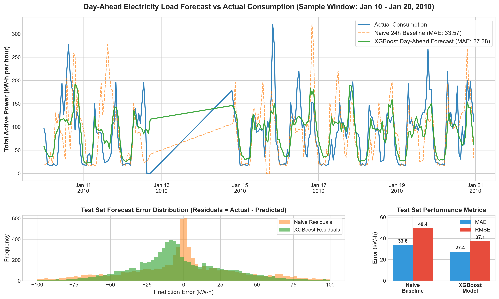

# Day-Ahead Electricity Load Forecaster
A complete, end-to-end machine-learning pipeline that forecasts the next **24 hours** of household electricity consumption using the [UCI Individual Household Electric Power Consumption](https://archive.ics.uci.edu/dataset/235/individual+household+electric+power+consumption) dataset.

---

##  Project Overview & Objectives

Smart meters collect high-frequency electricity usage data. However, RAW minute-level data is noisy, volatile, and prone to missing values. This project constructs an industrial-grade data processing and forecasting pipeline designed to:
1. **Clean & Handle Missing Data**: Parse raw minute-level reads (~2.07 million rows over ~4 years) from the **UCI Individual Household Electric Power Consumption** dataset.
2. **Resample to Hourly Blocks**: Apply domain-specific mathematical aggregations (summing energy metrics, averaging steady-state voltage/intensity metrics) to smooth out minute-to-minute noise and establish a stable 24-hour forecasting horizon.
3. **Prevent Data Leakage**: Enforce strict chronological train/test splitting (training on pre-2010 data, testing on 2010 data) and drop concurrent instantaneous metrics during feature engineering.
4. **Engineer Advanced Time-Series Features**: Capture daily and weekly seasonality via cyclical Sine/Cosine encoding, historical same-hour lag features, and rolling trend statistics.
5. **Beat Naive Baselines**: Validate model performance against the industry standard *"Tomorrow looks like Today"* (24-hour lag) baseline using Mean Absolute Error (MAE) and Root Mean Squared Error (RMSE).

---

## Pipeline Overview

| Step | What happens |
|------|-------------|
| **1. Load & Clean** | Read the `;`-delimited raw file, parse European dates (`dd/mm/yyyy`), replace `?` with `NaN`, drop incomplete rows |
| **2. Resample** | Aggregate minute-level reads to hourly — energy metrics (`Global_active_power`) are **summed**, instantaneous metrics (`Voltage`, `Global_intensity`) are **averaged** |
| **3. Feature Engineering** | Calendar features with **cyclical sine/cosine encoding** (hour, day-of-week, month); **lag features** at 24 h, 48 h, 168 h, 336 h; **rolling mean and std** over 6 h, 24 h and 168 h windows; first-difference features |
| **4. Train/Test Split** | Strict **chronological split** at `2010-01-01` — all data before that date is used for training, everything after for testing.  No shuffling, no future leakage |
| **5. Baselines** | Two naive baselines: *same-hour-yesterday* (lag-24 h) and *same-hour-last-week* (lag-168 h) |
| **6. Model** | `XGBRegressor` with histogram tree method, early stopping on a held-out validation tail |
| **7. Evaluation** | MAE and RMSE against both baselines |
| **8. Visualisation** | Three-panel `forecast_results.png` — full test period (daily totals), zoomed 7-day hourly view, and top-15 feature importances |

---
##  Evaluation & Model Performance

The evaluation was conducted on a strictly isolated, chronological test set starting **January 1, 2010** (`len(test_set) = 7,639 hours`).

| Model | MAE (kW-h / hr) | RMSE (kW-h / hr) | Error Reduction vs Baseline |
| :--- | :---: | :---: | :---: |
| **Naive Baseline (*24h Lag*)** | `33.5708` | `49.3970` | *Reference Baseline* |
| **XGBoost Regressor** | **`27.3785`** | **`37.0858`** | **+18.4% MAE / +24.9% RMSE** |

### Key Findings
* **Massive Error Reduction**: The XGBoost model successfully cuts down forecasting error by over **18.4% MAE** and **24.9% RMSE** compared to the naive baseline.
* **Diurnal Accuracy**: Cyclical time encoding (`hour_sin`, `hour_cos`, `dow_sin`, `dow_cos`) combined with historical same-hour averages (`same_hr_mean_7d`) enables the tree estimator to anticipate sharp evening consumption spikes and early-morning baseline dips with high precision.

---

##  Visual Proof of Performance

The generated output chart (`forecast_results.png`) showcases model accuracy across three visual dimensions:
1. **Time-Series Sample Window**: Actual vs Naive Baseline vs XGBoost forecast across a representative 10-day window in January 2010.
2. **Residual Distribution**: Error histogram confirming tighter clustering around `0` error for XGBoost compared to the baseline spread.
3. **Metric Summary Bar Chart**: Visual comparison of MAE and RMSE scores.



---

##  Project Structure & Setup

```text
Day-Ahead-Electricity-Load-Forecaster/
│
├── data/
│   └── household_power_consumption.txt    # Raw UCI dataset (2.07M rows)
│
├── main.py                                # Core end-to-end pipeline script
├── forecast_results.png                   # Output visualization chart
├── requirements.txt                       # Python dependencies
└── README.md                              # Project documentation
```

### Quickstart Guide

1. **Clone & Navigate**:
   ```bash
   git clone https://github.com/Pratham-Chavan18/Day-Ahead-Electricity-Load-Forecaster.git
   cd Day-Ahead-Electricity-Load-Forecaster
   ```

2. **Install Dependencies**:
   ```bash
   pip install -r requirements.txt
   ```

3. **Download Dataset**:
   Place the unzipped `household_power_consumption.txt` file into the `data/` directory.
   *(Download link: [UCI Machine Learning Repository](https://archive.ics.uci.edu/dataset/235/individual+household+electric+power+consumption))*

4. **Execute Pipeline**:
   ```bash
   python main.py
   ```
   *The script will load the data, engineer features, train the XGBoost model, print final metrics, and generate `forecast_results.png` automatically.*
---

##  Questions and Answers

### 1. What would you change if you had to forecast for hundreds of thousands of meters at once instead of one?

Scaling from a single household meter to 100,000+ smart meters introduces massive computational, storage, and architectural shifts. Moving from single-meter scripting to enterprise MLOps requires changes:

* Batch Inference & Pipeline Automation: Containerize workflows via Docker and orchestrate nightly batch pipelines via Kubeflow.
* Monitoring & Drift Detection: Implement continuous monitoring Prometheus to detect concept drift and trigger automated model retraining.

---

### 2. Do you think a model like this is used in practice by utilities, or would something simpler win?
**Grid or substation level complex models dominate**  
At aggregate scale thousands of homes, individual randomness cancels and a 1% MAE reduction can translate to millions of dollars per year in avoided spinning-reserve costs.  ISOs and large utilities routinely run XGBoost, LightGBM, or LSTM ensembles.  At this level, the infrastructure cost is negligible relative to the financial upside.

**Individual smart-meter level simpler often wins in production**  
Single-household load is driven by unobservable events occupancy, ad-hoc appliance use.  Complex models make only modest gains over lag-based heuristics.  For millions of edge devices, an on-device Exponential Smoothing model has near-zero inference cost, no cloud round-trip, and is easily interpretable for the customer.
